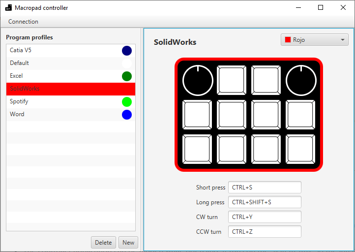

# Macropad

### Simple Ardunio based keyboard for shortcuts and macros.

This project consist of a simple keyboard that communicates via USB to a controller application. The keyboard sends information of the key that has been pressed and how. With that, the controller application manages the actions it need to execute based on the user configuration.

The use of a controller application has some advantages in comparisong of directly executing commands througth the Arduino. Some of the key aspects of this project are:

* Any user can configure the actions assigned to any button without the need of reprogramming the Arduino.
* The controller aplication can store different configuration profiles. So, the user can alternate the current profile depending on the application he/she is using.
* Any button in the keyboard has two possible actions -- *short press* and *long press*.
* It is possible to use also encoders, wich adds two more interaction to that position of the grid in the keyboard -- *clockwise (CW)* and *counter-clockwise (CCW)* rotation.
* The controller application can be hidden while not using. It runs on the System Tray, so the interface can be recover at any moment.

## How to use this project?

#### Software

1. Make sure you have a Java IDE on your PC, and JavaFX is available. Install the library [jSerialComm](https://fazecast.github.io/jSerialComm/).
2. Clone this repository on your PC.
3. Open the file [Macropad.java](src/macropad/Macropad.java) and change the constants according to your preferences.

``
public static int NUM_ROWS = 3;       //Number of rows of your macro keyboard
public static int NUM_COLUMNS = 4;    //Number of columns
public static String PROFILES_PATH = "D:/MacroKeypad/AppProfiles/";  //The path you want the information of profiles to be stored
public static int[] ENCODER_POSITIONS = {0, 3};  //The positions were the encoders are located within the keyboard matrix (0 to NUM_COLUMNS*NUM_ROWS - 1)
``

4. Run the file [MacropadController.java](src/macropad/MacropadController.java) as a Java Application.

#### Hardware

## Future releases

There is a lot of things that can be done to improve the project. Here are some features I want to add at some point. Feel free to contribute to this project and add thouse features, or any other

- [ ] It would be great if the controller application could detect automatically the program the user is using at any moment, and change the macropad profile accordingly.
- [ ] Add an option for the program to work by itself, without the need of an Arduino.
- [ ] Improve the connection process. Maybe if the last port used is still available when the application opens, connect automaticaly to it.

## Dependencies

The ibrary [jSerialComm](https://fazecast.github.io/jSerialComm/) is required to use this project.

## License

This project is [MIT Licensed](LICENSE).
